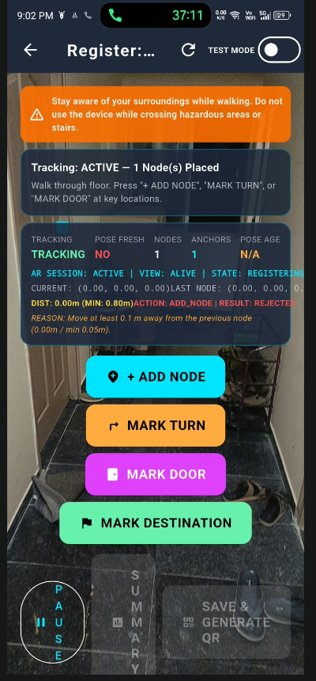

# 📍 PATHLUME — Indoor AR Navigation System

> **High-Precision Indoor Augmented Reality Navigation powered by Flutter, Native Android ARCore, OpenGL ES 3D Procedural Rendering, A* Graph Routing, and Cloud Firestore.**

---

## 🚀 Current Project Stage: Phase 4 Complete (Production-Ready Release v1.0.0)

PATHLUME is a fully realized, production-ready indoor AR navigation application built for real physical environments. The current release includes:
- **Cloud Firestore Backend Integration**: Connected to live project `pathlume-18e66` with offline fallback capabilities.
- **Graph Validation & Persistent Route Saving**: Complete `NavigationGraph` contract validation prior to database serialization.
- **`PATHLUME_V1` High-Contrast QR Code Generation & Scanning**: Scannable floor origin anchors for zero-drift spatial localization.
- **Hardened ARCore Tracking Stability**: Solved multi-node tracking interruptions through thread-safe anchor management and persistent native view lifecycle keying.
- **Verification Status**: 
  - `flutter analyze`: **0 Issues (Clean)**
  - `flutter test`: **69 / 69 Tests Passed (100%)**
  - Production Build: **Release APK compiled (`app-release.apk` - 66.0 MB)**

---

## 🏗️ Core Architecture & System Constraints

- **User Interface**: Flutter (Dart)
- **Native AR Engine**: Android / Kotlin (`ARCore`, `GLSurfaceView`, `OpenGL ES 2.0/3.0`)
- **Rendering Pipeline**: Procedural 3D OpenGL ES shader-based rendering (No Unity, No GLB assets, No external heavy engines)
- **Backend & Persistence**: Firebase / Cloud Firestore (`cloud_firestore`)
- **Localization Method**: QR Code Origin Identification + ARCore 6DoF VIO (Visual Inertial Odometry) (No VPS, No GPS, No fake/mocked poses)
- **Pathfinding Algorithm**: Custom A* (A-Star) shortest path computation on `NavigationGraph`
- **Data Abstraction**: `BuildingRepository` interface with `FirebaseBuildingRepository` and `LocalBuildingRepository` implementations.

---

## 🔄 End-to-End System Workflows

```
┌─────────────────────────────────────────────────────────────────────────────┐
│                         1. FLOOR REGISTRATION WORKFLOW                      │
└─────────────────────────────────────────────────────────────────────────────┘
  REGISTER BUILDING ──► CREATE FLOOR ──► OPEN AR CAMERA ──► WAIT FOR TRACKING
                                                                  │
  SUCCESS ANIMATION ◄── FIRESTORE WRITE ◄── SAVE ROUTE ◄── ADD NODES & DESTINATIONS
          │
  GENERATE QR ──► PRINTABLE / DISPLAYABLE FLOOR QR CODE (PATHLUME_V1)

┌─────────────────────────────────────────────────────────────────────────────┐
│                          2. AR NAVIGATION WORKFLOW                          │
└─────────────────────────────────────────────────────────────────────────────┘
  NAVIGATE MODE ──► SCAN FLOOR QR ──► DECODE (buildingId | floorId | originId)
                                                      │
  SELECT DESTINATION ◄── DESERIALIZE GRAPH ◄── QUERY FIRESTORE DATABASE
          │
  COMPUTE A* ROUTE ──► ROUTE PROJECTOR ──► NATIVE OPENGL ES 3D AR NAVIGATION
```

### 1. Registration Workflow
1. **Camera & AR Initialization**: The native `GLSurfaceView` mounts, binding the OES camera texture and starting an authoritative `ARCoreManager` session.
2. **Origin Anchor (Node 0)**: The user places Node 0 at a designated physical location (e.g., floor entry or pillar with the QR code).
3. **Multi-Node Mapping**: As the user walks, nodes are created at regular intervals. Specific nodes can be tagged as `TURN`, `DOOR`, or `DESTINATION` (with named labels).
4. **Graph Validation**: Prior to saving, `GraphValidator` checks:
   - Minimum required nodes and finite coordinates ($x, y, z \in \mathbb{R}$).
   - Absence of self-loops and presence of positive edge distances.
   - Graph connectivity and valid destination mapping.
5. **Firestore Persistence**: The validated `NavigationGraph` is serialized to `buildings/{buildingId}/floors/{floorId}`.
6. **QR Payload Generation**: Upon successful write, a high-contrast QR code encoding `PATHLUME_V1|<buildingId>|<floorId>|<originId>` is generated for printing/mounting at the origin.

### 2. Navigation Workflow
1. **QR Scanning & Decoding**: The user opens the Navigation camera and scans the floor's QR code.
2. **Database Lookup**: The app parses `PATHLUME_V1`, queries Cloud Firestore for the exact `floorId`, and reconstructs the precise 3D `NavigationGraph`.
3. **Spatial Relocalization**: The origin node coordinate system is aligned with the current ARCore 6DoF camera pose.
4. **Destination Selection & Routing**: The user selects a target destination. The A* algorithm computes the shortest path along physical waypoints.
5. **3D OpenGL AR Rendering**: `ARRenderer` draws procedural 3D directional arrows, waypoint spheres, and path lines directly overlaid onto physical space.

---

## 🛠️ AR Tracking Stability & Thread-Safety Engine

To eliminate tracking drops when adding multiple nodes, PATHLUME incorporates native hardening mechanisms:

| Architectural Component | Solution Implemented | Technical Benefit |
| :--- | :--- | :--- |
| **`ARAnchorManager.kt`** | `CopyOnWriteArrayList<Anchor>` & `ConcurrentHashMap` | Eliminates `ConcurrentModificationException` when mutating anchors on UI thread while rendering on GL thread. |
| **`FloorRegistrationScreen.dart`** | `key: const ValueKey('pathlume_registration_ar_view')` | Prevents `PlatformViewLink` unmounting and EGL context destruction during Flutter `setState()` rebuilds. |
| **`ARRenderer.kt`** | `try-finally` GL depth mask restoration | Guarantees `glDepthMask(true)` state restoration after custom 3D drawing to prevent camera background freezes. |
| **Diagnostics HUD** | Real-time `PATHLUME_AR` diagnostic overlay | Displays real-time session owner, tracking state, pose age, and GL surface state for debugging. |

---

## 📁 Repository Structure

```text
indoor navigation app/
├── android/
│   └── app/
│       ├── google-services.json           # Active Firebase configuration
│       └── src/main/kotlin/com/pathlume/app/ar/
│           ├── ARAnchorManager.kt         # Thread-safe 3D spatial anchor manager
│           ├── ARCoreManager.kt           # Authoritative ARCore session controller
│           ├── ARRenderer.kt              # OpenGL ES 2.0/3.0 procedural 3D renderer
│           ├── NativeARView.kt            # PlatformView GLSurfaceView wrapper
│           └── ARMethodChannel.kt         # Flutter <-> Kotlin bridge
├── lib/
│   ├── firebase_options.dart              # Default Firebase platform options
│   ├── main.dart                          # Application entry & Firebase initialization
│   ├── models/
│   │   ├── navigation_graph.dart          # Graph, Node, Edge, and Destination contracts
│   │   └── qr_payload.dart                # PATHLUME_V1 payload parser
│   ├── features/
│   │   ├── registration/                  # Floor registration & node placement UI
│   │   ├── navigation/                    # Destination selection & AR navigation UI
│   │   └── qr/                            # Printable QR code generation UI
│   └── services/
│       ├── graph_validator.dart           # Pre-save graph validation engine
│       ├── pathfinding/                   # A* (A-Star) routing implementation
│       └── repositories/
│           ├── building_repository.dart   # Abstract repository interface
│           └── firebase_building_repository.dart # Cloud Firestore implementation
├── test/                                  # 69 Unit & Widget tests
└── pubspec.yaml                           # Flutter package manifest
```

---

## ⚡ Developer Commands & Testing

### 1. Run Static Analysis
```bash
flutter analyze
```

### 2. Run Automated Unit & Widget Tests
```bash
flutter test
```

### 3. Build Production Release APK
```bash
flutter build apk --release
```
*Output binary location: `build/app/outputs/flutter-apk/app-release.apk`*

### 4. Install Release APK onto Physical ARCore Device
```bash
adb install -r build/app/outputs/flutter-apk/app-release.apk
```

---

## 📜 License & Project Credits
Developed as part of the **PATHLUME** Indoor AR Navigation Project. Built with Flutter, ARCore, Cloud Firestore, and OpenGL ES.
